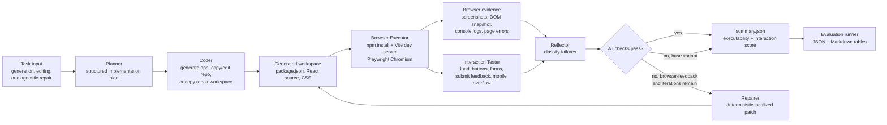

# WebPilot: Browser-Grounded Multimodal Web Coding Agent

[Прогресс по требованиям проекта](PROJECT_PROGRESS_RU.md)

WebPilot is a research/prototype project for a web coding agent that closes the loop between code generation and real browser evidence.

The MVP loop is:

```text
implement -> execute -> inspect -> repair
```

## Project Flow



Expected outcome: a local research prototype that can create or copy a front-end app, run it in a real browser, collect evidence, test basic interactions, repair known failures, and save auditable run artifacts.

## What Step 2 Supports

- Text-guided generation of a minimal Vite + React app.
- Mock dashboard generation with sidebar navigation, summary stats, and a data table.
- Instruction-guided editing of an existing Vite + React app for a small deterministic pattern set.
- Diagnostic repair using a local broken fixture.
- Browser execution with Playwright and Chromium.
- Dynamic Vite dev-server ports.
- Screenshot capture for desktop and mobile viewports.
- DOM snapshot capture.
- Console log and page error capture.
- Basic Playwright interaction checks.
- Deterministic browser-feedback repairs for known failure types.
- Heuristic `patch_quality` scoring for repair/editing tasks.
- Optional OpenAI-backed planning and code generation for `text_generation` tasks.
- `base` and `browser-feedback` variants.
- A small evaluation runner over JSON tasks.

Out of scope for this MVP: general-purpose editing, vision-guided generation, vision-guided editing, local model providers, WebCompass integration, visual-reflection/test-synthesis variants, backend, database, authentication, deployment.

## Known Limitations

- The repairer handles only a fixed set of hardcoded failure patterns: missing form fields, missing submit feedback, missing submit handler, mobile horizontal overflow, and a simple nav menu state-toggle repair. Other failures are reported as `no_automated_repair_available`.
- Editing currently handles only a fixed set of deterministic requested-change patterns: add testimonials, add FAQ, add newsletter signup, add a simple CTA button, and update simple CTA text/color. It is not a general code editing engine yet.
- Mock dashboard generation covers static sidebar/stats/table layouts, but not sorting, filtering, pagination, charts, or live data.
- With `--llm-provider openai`, Planner and Coder become LLM-driven for generation tasks, but the Repairer remains deterministic for now.
- Chromium is launched with sandbox workaround args by default: `--no-sandbox` and `--disable-setuid-sandbox`. Set `WEBPILOT_DISABLE_CHROMIUM_SANDBOX_ARGS=1` to disable those args on systems where the browser sandbox works normally.
- `patch_quality` is a heuristic proxy, not an LLM-judged or human-judged score. It combines localization, diff size, and targetedness. `visual_quality` is still a placeholder and currently returns `None`.
- Generated repairs are deterministic string edits, not robust AST-aware code transformations.

## Requirements

- Python `>=3.10`
- Node.js `>=18`
- Playwright Python package `1.56.0`
- Generated apps use Vite `^6.0.7`, React `^18.3.1`, React DOM `^18.3.1`, and `@vitejs/plugin-react` `^4.3.4`

## Installation

```bash
pip install -e ".[dev]"
python -m playwright install chromium
```

## Run Sample Text Generation

```bash
python -m webpilot.cli run --task webpilot/tasks/sample_text_generation.json --variant base --max-iterations 1
```

Mock mode is the default and does not call any external API:

```bash
python -m webpilot.cli run --task webpilot/tasks/sample_text_generation.json --variant base --max-iterations 1 --llm-provider mock
```

To use OpenAI for planning and generation, set an API key and opt in explicitly. Real API calls cost money.

```bash
export OPENAI_API_KEY="..."
python -m webpilot.cli run --task webpilot/tasks/sample_text_generation.json --variant browser-feedback --max-iterations 3 --llm-provider openai
```

## Run Browser Feedback

```bash
python -m webpilot.cli run --task webpilot/tasks/sample_text_generation.json --variant browser-feedback --max-iterations 3
```

## Run Diagnostic Repair

```bash
python -m webpilot.cli run --task webpilot/tasks/sample_diagnostic_repair.json --variant browser-feedback --max-iterations 3
```

The diagnostic task copies `webpilot/examples/buggy_repair_app` into the run workspace, executes it, detects missing form/feedback/overflow issues, and applies deterministic repairs when possible.

The nav repair sample verifies the deterministic state-toggle repair:

```bash
python -m webpilot.cli run --task webpilot/tasks/sample_nav_repair.json --variant browser-feedback --max-iterations 3
```

## Run Editing

```bash
python -m webpilot.cli run --task webpilot/tasks/sample_editing_task.json --variant base --max-iterations 1
```

The editing task copies `webpilot/examples/editable_landing_app` into the run workspace and applies a deterministic localized edit. The sample adds `TestimonialsSection.jsx`, imports it into `src/App.jsx`, renders it below pricing, and appends matching CSS.

Newsletter editing uses the same fixture and adds a signup form before contact:

```bash
python -m webpilot.cli run --task webpilot/tasks/sample_editing_newsletter.json --variant base --max-iterations 1
```

## Run Dashboard Generation

```bash
python -m webpilot.cli run --task webpilot/tasks/sample_dashboard_generation.json --variant base --max-iterations 1
```

The mock planner/coder recognize dashboard, sidebar navigation, summary stats, and data table instructions and generate `Sidebar.jsx`, `StatsBar.jsx`, and `DataTable.jsx`.

## Run Evaluation

```bash
python -m webpilot.evaluation.runner --tasks-dir webpilot/tasks --variant base --max-iterations 1
```

Evaluation output is written under:

```text
runs/evaluation/<timestamp>/
```

## Inspect Artifacts

Each CLI run writes artifacts under:

```text
runs/<task_id>/<timestamp>/
```

Each iteration writes:

```text
iteration_<n>/
  screenshot_desktop.png
  screenshot_mobile.png
  dom_snapshot.html
  console_logs.json
  page_errors.json
  dev_server_stdout.log
  dev_server_stderr.log
  test_results.json
  reflection.json
  edit_plan.json
  repair_plan.json
```

`edit_plan.json` is present only for editing tasks and includes `files_modified` plus unified diffs for the deterministic edit. `repair_plan.json` is present only when a repair is attempted. The final `summary.json` includes executability, interaction correctness, patch quality, failures found, edit/repair attempts, and the final workspace path.

`patch_quality` is computed only for `diagnostic_repair` and `editing` tasks. Formula: `0.4 * localization + 0.3 * size + 0.3 * targetedness`. Localization rewards touching fewer workspace files, size rewards smaller unified diffs, and targetedness rewards applied repairs or deterministic edits. `text_generation` tasks report `null` because there is no patch against an existing repository.

## Tests

```bash
python -m pytest tests/
```

The CLI smoke test skips explicitly if `npm`, the Playwright Python package, or the Chromium browser binary is missing.
