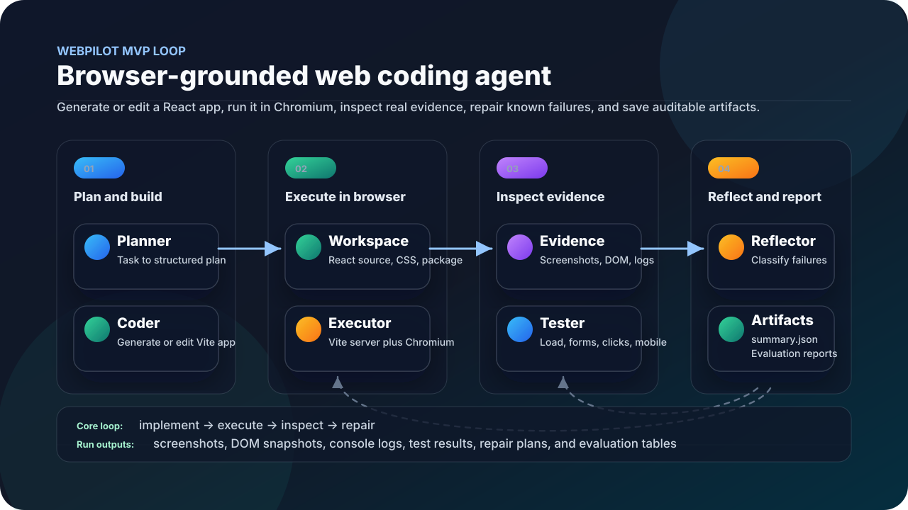

# WebPilot: Browser-Grounded Web Coding Agent

[Project Progress and Requirements Coverage](PROJECT_PROGRESS.md)

WebPilot is a research/prototype project for a web coding agent that closes the loop between code generation and real browser evidence. It can generate small React apps, edit existing React apps using deterministic patterns, run them in Chromium through Playwright, collect browser evidence, run interaction checks, and apply deterministic repairs for known failure types.

The current MVP loop is:

```text
implement -> execute -> inspect -> repair
```

## Project Flow

<p align="center">
  
</p>

Expected outcome: a local research prototype that can create or copy a front-end app, run it in a real browser, collect evidence, test basic interactions, repair known failures, and save auditable run artifacts.

## Current Capabilities

- Text-guided generation of minimal Vite + React apps.
- Deterministic dashboard generation with sidebar navigation, summary stats, and a data table.
- Deterministic blog/article generation with a main article column and related-posts sidebar.
- Instruction-guided editing of existing Vite + React apps for a small deterministic pattern set.
- Diagnostic repair of existing local fixtures.
- Browser execution with Playwright and Chromium.
- Dynamic Vite dev-server ports.
- Screenshot capture for desktop and mobile viewports.
- DOM snapshot capture.
- Console log and page error capture.
- Basic Playwright interaction checks.
- Deterministic browser-feedback repairs for known failure types, including simple form, overflow, nav menu, and tab-switcher bugs.
- Heuristic `patch_quality` scoring for repair/editing tasks.
- Basic `visual_sanity_score` smoke heuristic for nonblank rendered pages and mobile overflow signals.
- Optional OpenAI-backed planning with prompt logging, dry-run mode, and call budgets.
- `base` and `browser-feedback` variants.
- A small evaluation runner over JSON tasks.
- Written evaluation report at `evaluation/report.md`.

Out of scope for this MVP: general-purpose editing, vision-guided generation, vision-guided editing, local model providers, WebCompass integration, visual-reflection/test-synthesis variants, backend, database, authentication, deployment.

## Known Limitations

- The repairer handles only a fixed set of hardcoded failure patterns: missing form fields, missing submit feedback, missing submit handler, mobile horizontal overflow, a simple nav menu state-toggle repair, and a simple tab-switcher state repair. Other failures are reported as `no_automated_repair_available`.
- Editing currently handles only a fixed set of deterministic requested-change patterns: add testimonials, add FAQ, add newsletter signup, add a simple CTA button, add a secondary CTA button, and update simple CTA text/color. It is not a general code editing engine yet.
- Mock dashboard generation covers static sidebar/stats/table layouts, but not sorting, filtering, pagination, charts, or live data.
- Mock blog generation covers a static article plus related-posts sidebar, not a general publishing system.
- With `--llm-provider openai`, the agent can use OpenAI for structured planning while keeping deterministic coding and repair as the safe default for now.
- Chromium is launched with sandbox workaround args by default: `--no-sandbox` and `--disable-setuid-sandbox`. Set `WEBPILOT_DISABLE_CHROMIUM_SANDBOX_ARGS=1` to disable those args on systems where the browser sandbox works normally.
- `patch_quality` is a heuristic proxy, not an LLM-judged or human-judged score. It combines localization, diff size, and targetedness. `visual_sanity_score` is also a basic heuristic, not a visual judge. `visual_quality` is still the paper-aligned multimodal-judge placeholder and currently returns `None`.
- Generated repairs are deterministic string edits, not robust AST-aware code transformations.

## Requirements

- Python `>=3.10`
- Node.js `>=18`
- Playwright Python package `1.56.0`
- Generated apps use Vite `^6.0.7`, React `^18.3.1`, React DOM `^18.3.1`, and `@vitejs/plugin-react` `^4.3.4`

## Installation

```bash
pip install -e ".[dev]"
python -m playwright install chromium
```

## Run Sample Text Generation

```bash
python -m webpilot.cli run --task webpilot/tasks/sample_text_generation.json --variant base --max-iterations 1
```

Mock mode is the default and does not call any external API:

```bash
python -m webpilot.cli run --task webpilot/tasks/sample_text_generation.json --variant base --max-iterations 1 --llm-provider mock
```

## Using OpenAI Safely

Mock mode is the default. It does not call external APIs and is the recommended mode for normal development and evaluation:

```bash
python3 -m webpilot.cli run \
  --task webpilot/tasks/sample_text_generation.json \
  --variant base \
  --max-iterations 1 \
  --llm-provider mock
```

OpenAI is opt-in. Set `OPENAI_API_KEY` only when you are ready to make a real paid call. You can choose the model and sampling parameters with:

```bash
export OPENAI_API_KEY="sk-..."
export WEBPILOT_OPENAI_MODEL="gpt-4o-mini"
export WEBPILOT_OPENAI_MAX_TOKENS="1200"
export WEBPILOT_OPENAI_TEMPERATURE="0.2"
```

Always inspect prompts with dry-run mode before spending credits. Dry-run logs prompt artifacts under `runs/<task_id>/<timestamp>/iteration_0/llm_calls/` and does not call the API:

```bash
python3 -m webpilot.cli run \
  --task webpilot/tasks/sample_text_generation.json \
  --variant browser-feedback \
  --max-iterations 1 \
  --llm-provider openai \
  --dry-run-llm \
  --max-llm-calls 1
```

For one deliberate tiny real run, remove `--dry-run-llm` and keep `--max-llm-calls 1`:

```bash
python3 -m webpilot.cli run \
  --task webpilot/tasks/sample_text_generation.json \
  --variant browser-feedback \
  --max-iterations 1 \
  --llm-provider openai \
  --max-llm-calls 1
```

Do not run evaluation batches with OpenAI until prompts have been inspected. The evaluation runner blocks OpenAI batches unless you explicitly pass `--allow-paid-batch`:

```bash
python3 -m webpilot.evaluation.runner \
  --tasks-dir webpilot/tasks \
  --variant browser-feedback \
  --llm-provider openai \
  --allow-paid-batch \
  --max-llm-calls 3
```

The current OpenAI integration is intentionally narrow: it is used for structured planning first. Deterministic coding and deterministic safe repairs remain the default execution path.

## Run Browser Feedback

```bash
python -m webpilot.cli run --task webpilot/tasks/sample_text_generation.json --variant browser-feedback --max-iterations 3
```

## Run Diagnostic Repair

```bash
python -m webpilot.cli run --task webpilot/tasks/sample_diagnostic_repair.json --variant browser-feedback --max-iterations 3
```

The diagnostic task copies `webpilot/examples/buggy_repair_app` into the run workspace, executes it, detects missing form/feedback/overflow issues, and applies deterministic repairs when possible.

The nav repair sample verifies the deterministic state-toggle repair:

```bash
python -m webpilot.cli run --task webpilot/tasks/sample_nav_repair.json --variant browser-feedback --max-iterations 3
```

The tabs repair sample verifies the deterministic tab-switcher state repair and the `tabs_switch_content` interaction check:

```bash
python -m webpilot.cli run --task webpilot/tasks/sample_tabs_repair.json --variant browser-feedback --max-iterations 3
```

## Run Editing

```bash
python -m webpilot.cli run --task webpilot/tasks/sample_editing_task.json --variant base --max-iterations 1
```

The editing task copies `webpilot/examples/editable_landing_app` into the run workspace and applies a deterministic localized edit. The sample adds `TestimonialsSection.jsx`, imports it into `src/App.jsx`, renders it below pricing, and appends matching CSS.

Newsletter editing uses the same fixture and adds a signup form before contact:

```bash
python -m webpilot.cli run --task webpilot/tasks/sample_editing_newsletter.json --variant base --max-iterations 1
```

Secondary CTA editing uses the same fixture and adds a second hero action:

```bash
python -m webpilot.cli run --task webpilot/tasks/sample_editing_secondary_cta.json --variant base --max-iterations 1
```

## Run Dashboard Generation

```bash
python -m webpilot.cli run --task webpilot/tasks/sample_dashboard_generation.json --variant base --max-iterations 1
```

The mock planner/coder recognize dashboard, sidebar navigation, summary stats, and data table instructions and generate `Sidebar.jsx`, `StatsBar.jsx`, and `DataTable.jsx`.

## Run Blog/Article Generation

```bash
python -m webpilot.cli run --task webpilot/tasks/sample_blog_generation.json --variant base --max-iterations 1
```

The mock planner/coder recognize blog/article/related-posts instructions and generate `ArticleLayout.jsx` plus `RelatedPosts.jsx`.

## Run Evaluation

```bash
python -m webpilot.evaluation.runner --tasks-dir webpilot/tasks --variant base --max-iterations 1
python -m webpilot.evaluation.runner --tasks-dir webpilot/tasks --variant browser-feedback --max-iterations 3
```

Evaluation output is written under:

```text
runs/evaluation/<timestamp>/
```

## Inspect Artifacts

Each CLI run writes artifacts under:

```text
runs/<task_id>/<timestamp>/
```

Each iteration writes:

```text
iteration_<n>/
  screenshot_desktop.png
  screenshot_mobile.png
  dom_snapshot.html
  console_logs.json
  page_errors.json
  dev_server_stdout.log
  dev_server_stderr.log
  test_results.json
  reflection.json
  edit_plan.json
  repair_plan.json
```

`edit_plan.json` is present only for editing tasks and includes `files_modified` plus unified diffs for the deterministic edit. `repair_plan.json` is present only when a repair is attempted. The final `summary.json` includes executability, interaction correctness, patch quality, failures found, edit/repair attempts, and the final workspace path.

`patch_quality` is computed only for `diagnostic_repair` and `editing` tasks. Formula: `0.4 * localization + 0.3 * size + 0.3 * targetedness`. Localization rewards touching fewer workspace files, size rewards smaller unified diffs, and targetedness rewards applied repairs or deterministic edits. `text_generation` tasks report `null` because there is no patch against an existing repository.

`visual_sanity_score` is a separate browser-evidence smoke heuristic. It checks that the page loaded, the DOM snapshot is not blank, and the mobile overflow check passes when available. It is intentionally not written into `visual_quality`. The paper's `visual_quality` metric requires a real multimodal LLM or visual judge and currently remains `null`.

## Tests

```bash
python -m pytest tests/
```

The CLI smoke test skips explicitly if `npm`, the Playwright Python package, or the Chromium browser binary is missing.

## Current Evaluation Snapshot

The latest documented evaluation covers 9 tasks across generation, editing, and diagnostic repair. In the refreshed browser-feedback run, all 9 tasks passed interaction checks. See [evaluation/report.md](evaluation/report.md) for the full table, artifact paths, and case studies.
